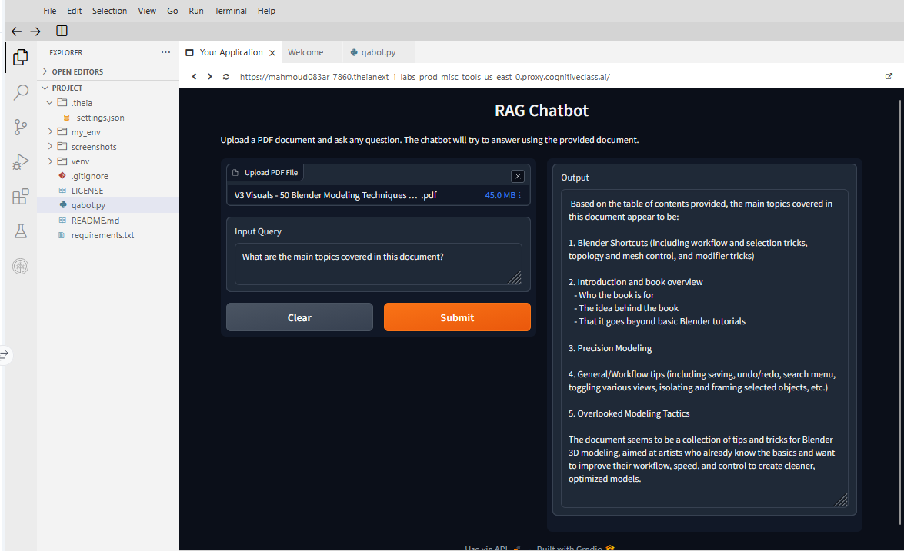

# RAG PDF Question-Answering Chatbot

A Retrieval-Augmented Generation (RAG) application that lets users upload PDF documents and ask questions about their contents.

The application processes the document, creates vector embeddings, retrieves the most relevant sections for a query, and uses an IBM watsonx.ai language model to generate a grounded response.

## Features

- Upload PDF documents through a web interface
- Extract PDF content using PyPDFLoader
- Split documents into manageable text chunks
- Generate embeddings with IBM watsonx.ai
- Store and search embeddings using ChromaDB
- Retrieve semantically relevant document sections
- Generate answers using LangChain RetrievalQA
- Interactive Gradio interface

## Architecture

PDF Upload  
↓  
PyPDFLoader  
↓  
RecursiveCharacterTextSplitter  
↓  
IBM watsonx.ai Embeddings  
↓  
ChromaDB Vector Store  
↓  
Semantic Retriever  
↓  
LangChain RetrievalQA  
↓  
IBM watsonx.ai LLM  
↓  
Gradio Web Interface

## Technologies

- Python
- LangChain
- IBM watsonx.ai
- ChromaDB
- Gradio
- PyPDF
- Hugging Face Hub

## Project Structure

- `qabot.py` — Main RAG application
- `requirements.txt` — Python dependencies
- `screenshots/` — Application screenshots
- `.gitignore` — Files excluded from version control
- `LICENSE` — MIT License

## How It Works

1. The user uploads a PDF.
2. The PDF is loaded and converted into LangChain documents.
3. The text is divided into overlapping chunks.
4. Each chunk is converted into a vector embedding.
5. ChromaDB stores and indexes the embeddings.
6. The user's question is embedded and compared against the stored vectors.
7. Relevant document chunks are retrieved.
8. The retrieved context and question are passed to the LLM.
9. The generated answer is displayed through Gradio.

## Installation

Clone the repository:

    git clone https://github.com/Mahmoud083/rag-pdf-qa-chatbot.git
    cd rag-pdf-qa-chatbot

Create a virtual environment:

    python -m venv venv
    source venv/bin/activate

Install dependencies:

    pip install -r requirements.txt

Run the application:

    python qabot.py

The Gradio interface runs on port `7860`.

## Example Usage

Upload a PDF and ask a question such as:

> What is the main topic of this document?

The application retrieves relevant information from the uploaded PDF and generates an answer based on that context.

## RAG Pipeline

This project demonstrates a complete Retrieval-Augmented Generation workflow rather than relying solely on the language model's internal knowledge.

Using retrieval allows the application to answer questions using information contained in documents that were not part of the model's original training data.

## Project Background

This application was developed as part of the IBM Generative AI Engineering coursework and expanded into a portfolio project demonstrating an end-to-end RAG pipeline using LangChain, vector databases, embeddings, an LLM, and a web interface.

## License

This project is licensed under the MIT License.

## Demo

